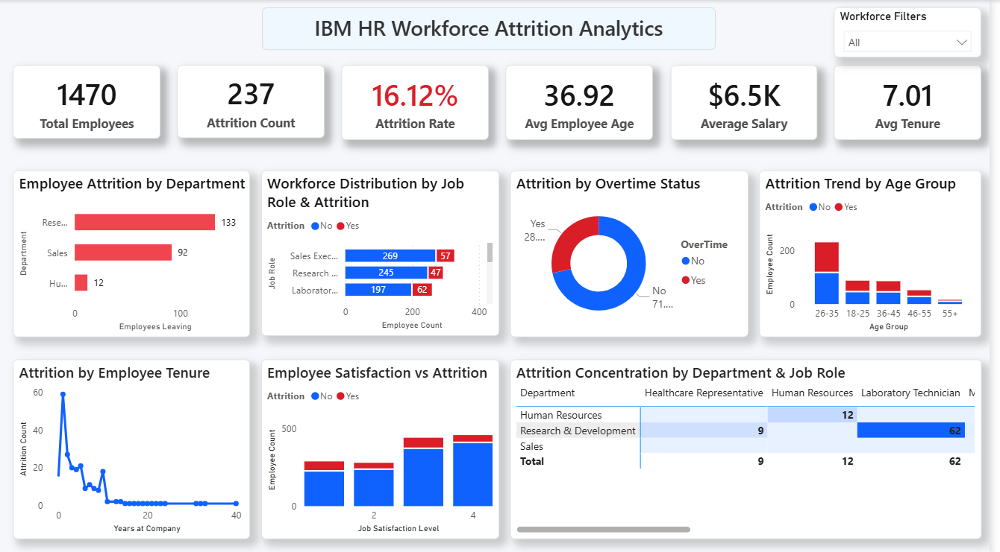

# hr-attrition-analysis-dashboard-powerbi
Power BI dashboard analyzing employee attrition trends, workforce distribution, and key HR metrics using DAX and data modeling.
# HR Attrition Analysis Dashboard (Power BI)

## 📊 Overview
This project analyzes employee attrition and workforce trends using Power BI.

## 📌 Key KPIs
- Total Employees: 1470
- Attrition Count: 237
- Attrition Rate: 16.12%
- Avg Employee Age: 36.9
- Avg Salary: $6.5K
- Avg Tenure: 7 years

## 📈 Key Insights
- Employees working overtime show higher attrition
- Age group 26–35 has highest attrition rate
- Low job satisfaction leads to increased employee exits
- Certain job roles and departments have higher attrition concentration

## 🛠 Tools Used
- Power BI
- Power Query
- DAX

## 📁 Dataset Source
IBM HR Analytics Dataset (Kaggle)

## 📷 Dashboard Preview

